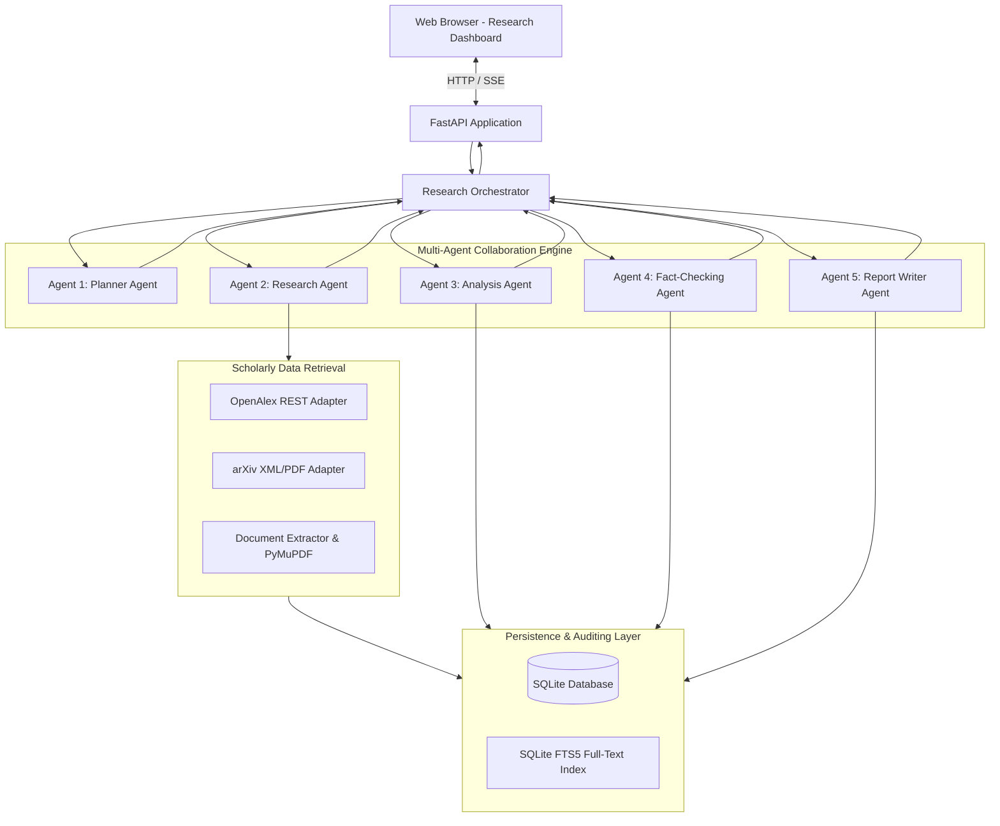
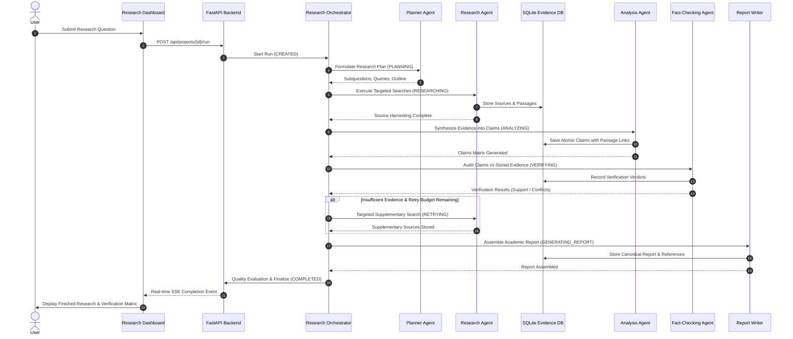
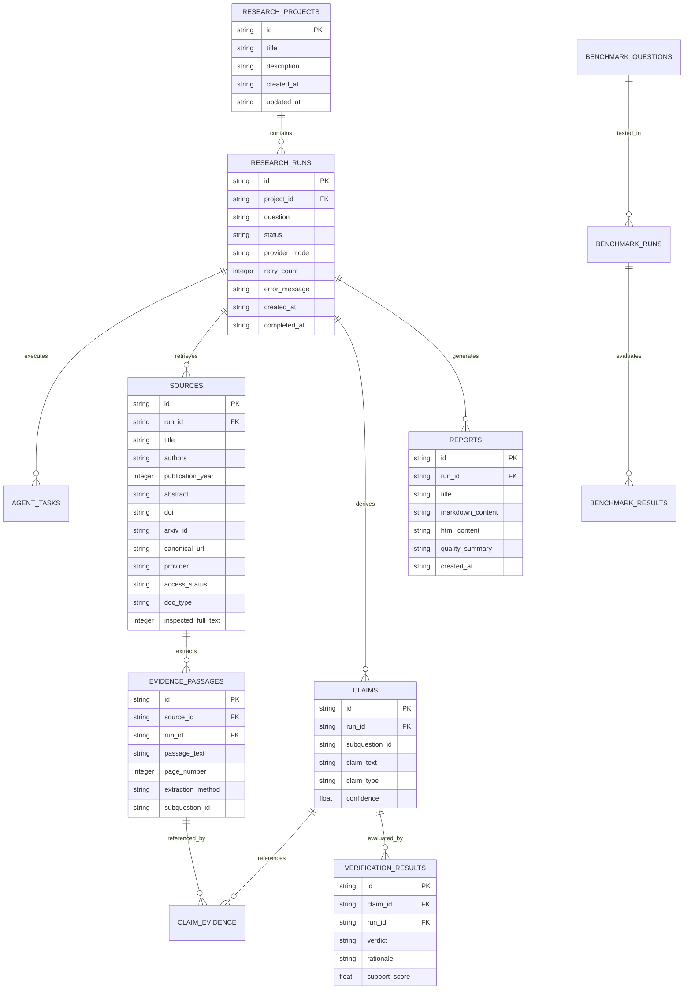
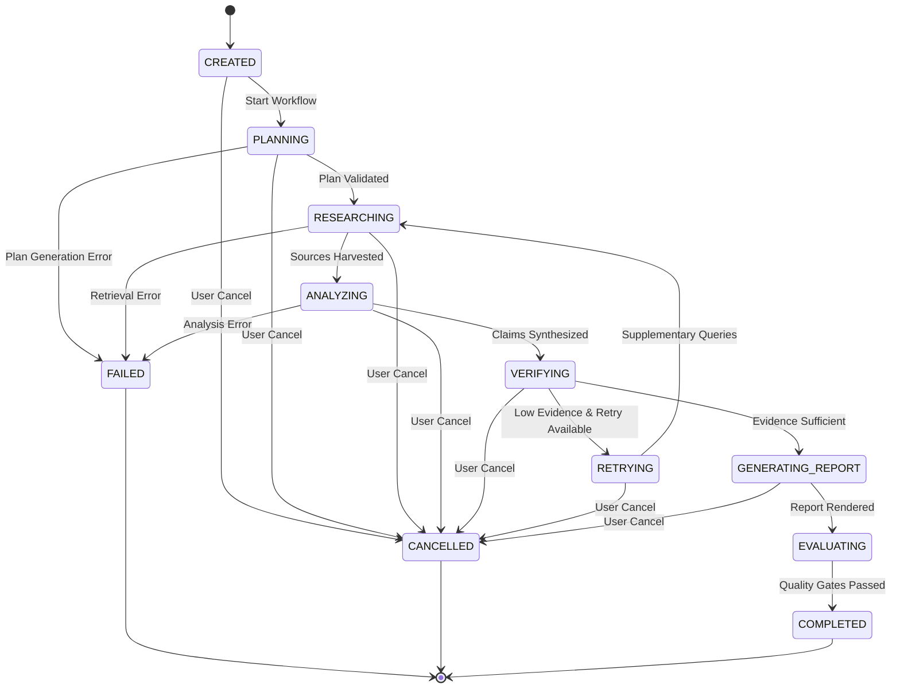

# System Diagrams

## 1. System Architecture Diagram

```mermaid
graph TD
    Client[Web Browser - Research Dashboard] <-->|HTTP / SSE| FastAPISrv[FastAPI Application]
    FastAPISrv --> Orchestrator[Research Orchestrator]
    
    subgraph MultiAgentEngine [Multi-Agent Collaboration Engine]
        Planner[Agent 1: Planner Agent]
        Researcher[Agent 2: Research Agent]
        Analyst[Agent 3: Analysis Agent]
        FactChecker[Agent 4: Fact-Checking Agent]
        ReportWriter[Agent 5: Report Writer Agent]
    end

    subgraph DataCollection [Scholarly Data Retrieval]
        OpenAlexAdapter[OpenAlex REST Adapter]
        ArXivAdapter[arXiv XML/PDF Adapter]
        DocExtractor[Document Extractor & PyMuPDF]
    end

    subgraph StorageLayer [Persistence & Auditing Layer]
        SQLiteDB[(SQLite Database)]
        FTS5Engine[SQLite FTS5 Full-Text Index]
    end

    Orchestrator --> Planner
    Planner --> Orchestrator
    Orchestrator --> Researcher
    Researcher --> DataCollection
    DataCollection --> StorageLayer
    Researcher --> Orchestrator
    Orchestrator --> Analyst
    Analyst --> StorageLayer
    Analyst --> Orchestrator
    Orchestrator --> FactChecker
    FactChecker --> StorageLayer
    FactChecker --> Orchestrator
    Orchestrator --> ReportWriter
    ReportWriter --> StorageLayer
    ReportWriter --> Orchestrator
    Orchestrator --> FastAPISrv
```

## 2. Agent Collaboration Sequence Diagram

```mermaid
sequenceDiagram
    autonumber
    actor User
    participant UI as Research Dashboard
    participant API as FastAPI Backend
    participant Orch as Research Orchestrator
    participant P as Planner Agent
    participant R as Research Agent
    participant DB as SQLite Evidence DB
    participant A as Analysis Agent
    participant F as Fact-Checking Agent
    participant W as Report Writer

    User->>UI: Submit Research Question
    UI->>API: POST /api/projects/{id}/run
    API->>Orch: Start Run (CREATED)
    Orch->>P: Formulate Research Plan (PLANNING)
    P-->>Orch: Subquestions, Queries, Outline
    Orch->>R: Execute Targeted Searches (RESEARCHING)
    R->>DB: Store Sources & Passages
    R-->>Orch: Source Harvesting Complete
    Orch->>A: Synthesize Evidence into Claims (ANALYZING)
    A->>DB: Save Atomic Claims with Passage Links
    A-->>Orch: Claims Matrix Generated
    Orch->>F: Audit Claims vs Stored Evidence (VERIFYING)
    F->>DB: Record Verification Verdicts
    F-->>Orch: Verification Results (Support / Conflicts)
    alt Insufficient Evidence & Retry Budget Remaining
        Orch->>R: Targeted Supplementary Search (RETRYING)
        R-->>Orch: Supplementary Sources Stored
    end
    Orch->>W: Assemble Academic Report (GENERATING_REPORT)
    W->>DB: Store Canonical Report & References
    W-->>Orch: Report Assembled
    Orch->>API: Quality Evaluation & Finalize (COMPLETED)
    API-->>UI: Real-time SSE Completion Event
    UI->>User: Display Finished Research & Verification Matrix
```

## 3. Database Entity-Relationship Diagram

```mermaid
erDiagram
    RESEARCH_PROJECTS ||--o{ RESEARCH_RUNS : contains
    RESEARCH_RUNS ||--o{ AGENT_TASKS : executes
    RESEARCH_RUNS ||--o{ SOURCES : retrieves
    SOURCES ||--o{ EVIDENCE_PASSAGES : extracts
    RESEARCH_RUNS ||--o{ CLAIMS : derives
    CLAIMS ||--o{ CLAIM_EVIDENCE : references
    EVIDENCE_PASSAGES ||--o{ CLAIM_EVIDENCE : referenced_by
    CLAIMS ||--o{ VERIFICATION_RESULTS : evaluated_by
    RESEARCH_RUNS ||--o{ REPORTS : generates
    BENCHMARK_QUESTIONS ||--o{ BENCHMARK_RUNS : tested_in
    BENCHMARK_RUNS ||--o{ BENCHMARK_RESULTS : evaluates

    RESEARCH_PROJECTS {
        string id PK
        string title
        string description
        string created_at
        string updated_at
    }

    RESEARCH_RUNS {
        string id PK
        string project_id FK
        string question
        string status
        string provider_mode
        integer retry_count
        string error_message
        string created_at
        string completed_at
    }

    SOURCES {
        string id PK
        string run_id FK
        string title
        string authors
        integer publication_year
        string abstract
        string doi
        string arxiv_id
        string canonical_url
        string provider
        string access_status
        string doc_type
        integer inspected_full_text
    }

    EVIDENCE_PASSAGES {
        string id PK
        string source_id FK
        string run_id FK
        string passage_text
        integer page_number
        string extraction_method
        string subquestion_id
    }

    CLAIMS {
        string id PK
        string run_id FK
        string subquestion_id
        string claim_text
        string claim_type
        float confidence
    }

    VERIFICATION_RESULTS {
        string id PK
        string claim_id FK
        string run_id FK
        string verdict
        string rationale
        float support_score
    }

    REPORTS {
        string id PK
        string run_id FK
        string title
        string markdown_content
        string html_content
        string quality_summary
        string created_at
    }
```

## 4. State Machine Diagram

```mermaid
stateDiagram-v2
    [*] --> CREATED
    CREATED --> PLANNING : Start Workflow
    PLANNING --> RESEARCHING : Plan Validated
    PLANNING --> FAILED : Plan Generation Error
    RESEARCHING --> ANALYZING : Sources Harvested
    RESEARCHING --> FAILED : Retrieval Error
    ANALYZING --> VERIFYING : Claims Synthesized
    ANALYZING --> FAILED : Analysis Error
    VERIFYING --> RETRYING : Low Evidence & Retry Available
    RETRYING --> RESEARCHING : Supplementary Queries
    VERIFYING --> GENERATING_REPORT : Evidence Sufficient
    GENERATING_REPORT --> EVALUATING : Report Rendered
    EVALUATING --> COMPLETED : Quality Gates Passed
    
    CREATED --> CANCELLED : User Cancel
    PLANNING --> CANCELLED : User Cancel
    RESEARCHING --> CANCELLED : User Cancel
    ANALYZING --> CANCELLED : User Cancel
    VERIFYING --> CANCELLED : User Cancel
    RETRYING --> CANCELLED : User Cancel
    GENERATING_REPORT --> CANCELLED : User Cancel

    FAILED --> [*]
    CANCELLED --> [*]
    COMPLETED --> [*]
```
